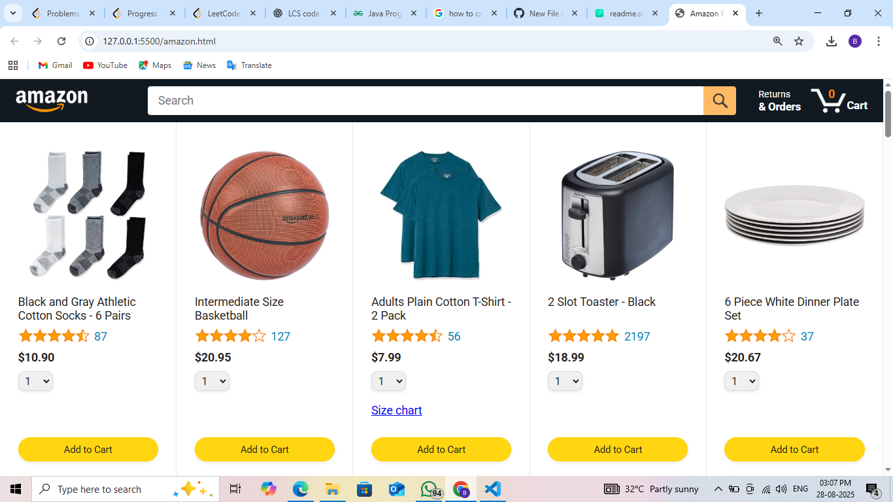
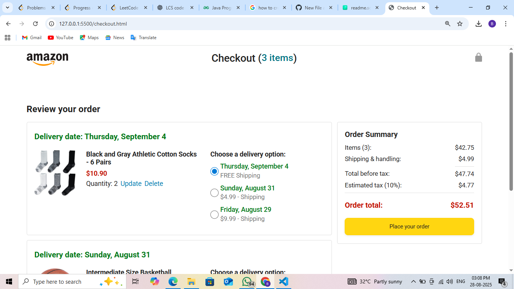
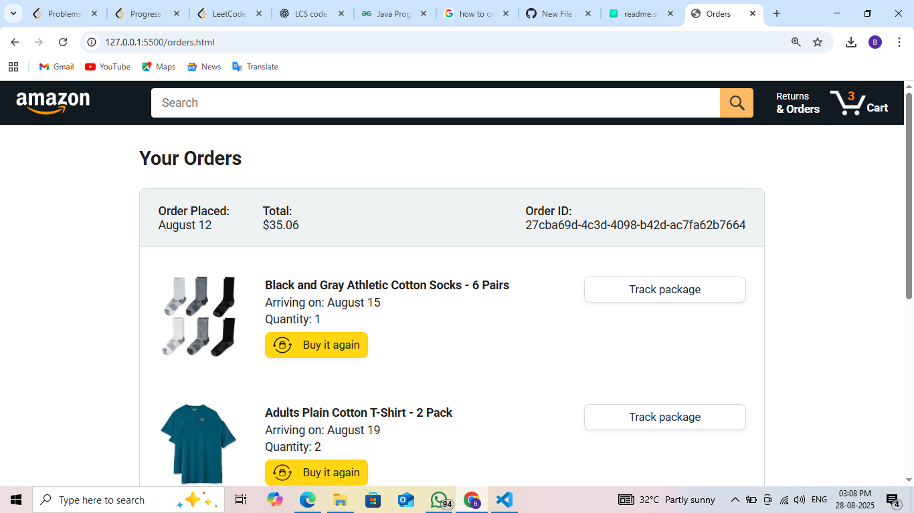
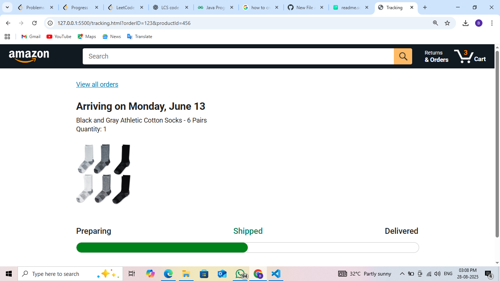

# 🛒 Amazon Clone Project

A front-end Amazon clone project built using **HTML, CSS, and JavaScript** with modular code, product data handling, and order management.  
This project simulates an **e-commerce shopping experience** including browsing products, adding to cart, checkout, and order tracking.  

---

## 🚀 Features

- 📦 **Product Listings** – Displays products dynamically using `products.json`.
- 🛒 **Shopping Cart** – Add, update, and remove items with OOP-based `cart.js`.
- 💳 **Checkout Flow** – Order summary, payment summary, and confirmation.
- 📦 **Orders Page** – View past orders from simulated data.
- 🚚 **Tracking Page** – Simulate order shipment tracking.
- 🔄 **Reusable Components** – Modular JS structure for cart, products, and delivery options.
- 🧪 **Unit Testing** – Jasmine framework for testing cart and money utilities.

---

## 📂 Project Structure

```
C:.
|   amazon.html          # Homepage (Amazon UI clone)
|   checkout.html        # Checkout page
|   orders.html          # Orders history
|   tracking.html        # Tracking page
|
+---backend
|       products.json    # Mock product data
|
+---data
|       backend-practice.js
|       cart-class.js
|       cart-oop.js
|       cart.js
|       deliveryOptions.js
|       orders.js
|       products.js
|
+---images
|   |   amazon-logo.png
|   |   amazon-logo-white.png
|   |   appliance-instructions.png
|   |   ...
|   +---icons
|   |       cart-icon.png
|   |       search-icon.png
|   |       hamburger-menu.png
|   |
|   +---products
|   |       backpack.jpg
|   |       men-athletic-shoes-green.jpg
|   |       ...
|   |
|   \---ratings
|           rating-0.png
|           rating-05.png
|           ...
|
+---scripts
|   |   amazon.js        # Homepage script
|   |   checkout.js      # Checkout logic
|   |
|   +---checkout
|   |       orderSummary.js
|   |       paymentSummary.js
|   |
|   \---utils
|           money.js     # Money formatting utility
|
+---styles
|   +---pages
|   |   amazon.css
|   |   orders.css
|   |   tracking.css
|   |
|   +---checkout
|   |   checkout.css
|   |   checkout-header.css
|   |
|   \---shared
|           amazon-header.css
|           general.css
|
\---tests-jasmine
    |   tests.html
    |   MIT.LICENSE
    |
    +---checkout
    |       orderSummaryTest.js
    |
    +---data
    |       cartTest.js
    |
    +---lib
    |   \---jasmine-5.1.1   # Jasmine Testing Framework
    |
    +---tests-simple
    |       moneyTest.js
    |
    \---utils
            moneyTest.js
```

---

## 🛠️ Technologies Used

- **HTML5** – Structure
- **CSS3** – Styling & Layout
- **Vanilla JavaScript (ES6+)** – Logic & Dynamic Content
- **JSON** – Product data storage
- **Jasmine** – Unit Testing

---

## ⚡ Setup Instructions

1. Clone this repository:
   ```bash
   git clone https://github.com/Bala-new/JAVASCRIPT---AMAZON---PROJECT.git
   cd JAVASCRIPT---AMAZON---PROJECT
   ```

2. Open the project in your browser:
   - `amazon.html` → Homepage
   - `checkout.html` → Checkout
   - `orders.html` → Orders
   - `tracking.html` → Tracking

3. To run tests:
   - Open `tests-jasmine/tests.html` in your browser.
   - Check results in Jasmine test runner.

---

## 📸 Screenshots

### 🏠 Homepage


### 🛒 Checkout


### 📦 Orders


### 🚚 Tracking


*(Screenshots to be added inside `images/screenshots/` folder.)*

---

## 🧪 Testing

- `cartTest.js` → Tests for cart operations
- `orderSummaryTest.js` → Tests for order summary
- `moneyTest.js` → Tests for money utility

Run tests via:
```bash
open tests-jasmine/tests.html
```

---

## 🤝 Contribution

1. Fork the repo 🍴  
2. Create a branch 🌿  
3. Commit changes 💾  
4. Push and create PR 🚀  

---

## 📜 License

This project is licensed under the **MIT License**.  
See [MIT.LICENSE](tests-jasmine/MIT.LICENSE) for details.

---

💡 *This project is for learning and practice purposes only. It is not affiliated with Amazon in any way.*
